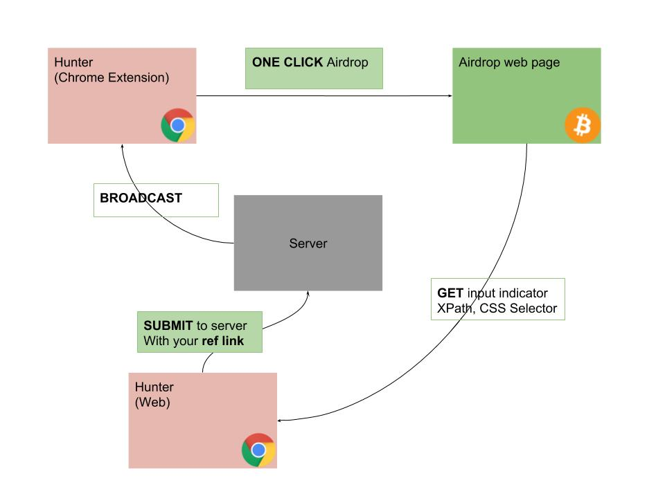

# airhunt-frontend
Chrome extension help you to control all of your information that is used for airdrop. 
And you could control and use it effectively 

## Architecture
We have a server to received new information (css selector of XPath) of the new airdrop.
After that it is gonna broadcast that to other chrome extension user.

Chrome extension user can receive the most updated information to join the Airdrop instantly.

    

