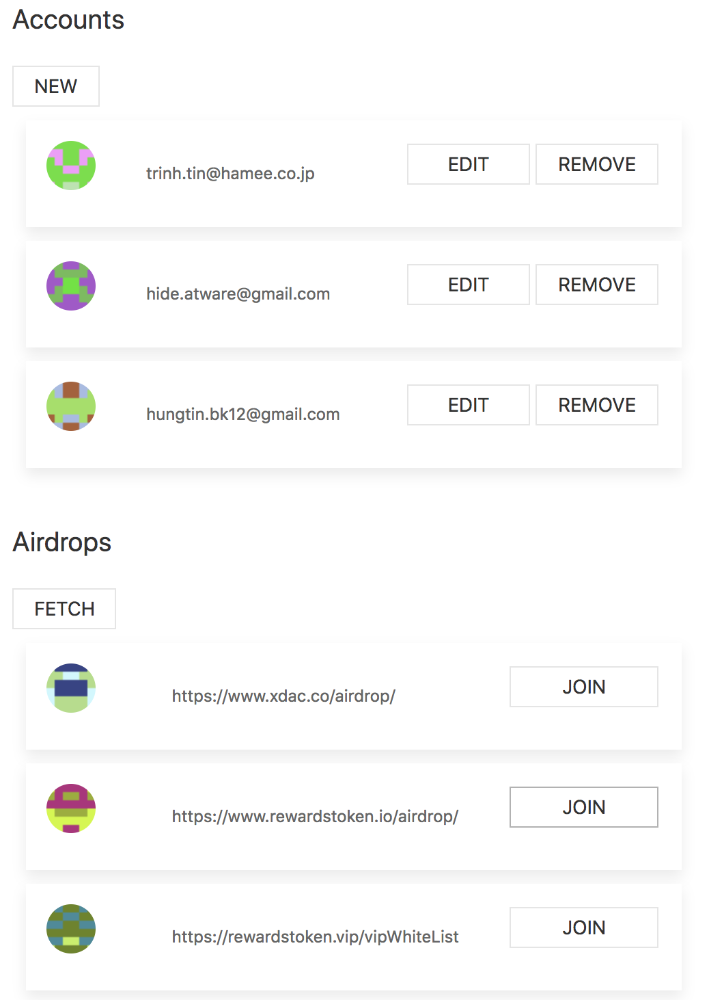
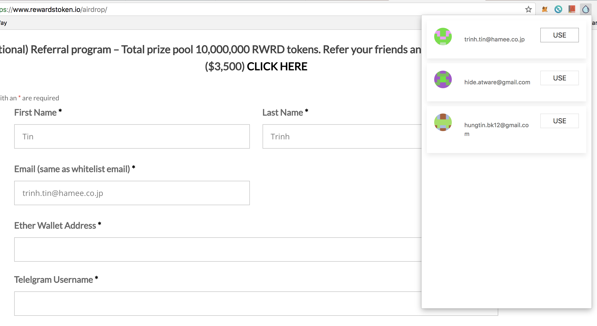

# airdrop-hunter
Help you to control all of your messy information that is used for airdrop. 
And help you to automatically fill it in any airdrop form quickly. 

## How it work
The admin from your community will do the airdrop first.
They will capture new information (css selector of airdrop form) of the new airdrops.
And put them into a google sheet file. 

All the member in your community can join and finish airdrop process by one click.
The automatic function only work with the url from google sheet. 
So you could use it to make funding for your community.

## Usage

### Options page

    

In option page, you can add new information, and fetch new airdrop information

### Popup page

    

Access any airdrop website from Options page. And you can instantly-fill-in all form by one click for each account.

## TODO 

- Import, export account info to CSV file
- Add dynamically community link
- Refactor code
